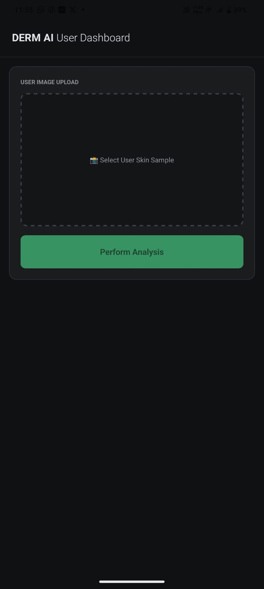
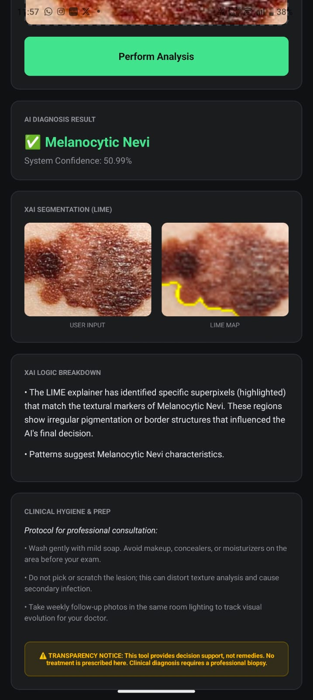

# AI-Based Skin Disease Classification with XAI

## 📌 Overview
This project is an AI-powered mobile application that classifies skin diseases using a Convolutional Neural Network (CNN). It allows users to upload images and receive predictions along with confidence scores and hygiene recommendations.

## 🚀 Features
- Real-time skin disease prediction
- Confidence-based classification system
- Explainable AI (LIME) for transparency
- Full-stack implementation (React Native + Flask)

## 🛠️ Tech Stack
- Frontend: React Native (Expo)
- Backend: Python Flask
- Machine Learning: CNN (Keras, TensorFlow)
- XAI: LIME

## 📂 Project Structure
- Frontend/ → Mobile app interface
- Backend/ → API and model handling

## ⚠️ Note
Model and dataset files are not included due to size limitations.

## 💡 About
This project was built by learning and applying AI and development concepts to create a real-world application.

## 📸 Screenshots

### App Interface

## Classification and XAI output result

